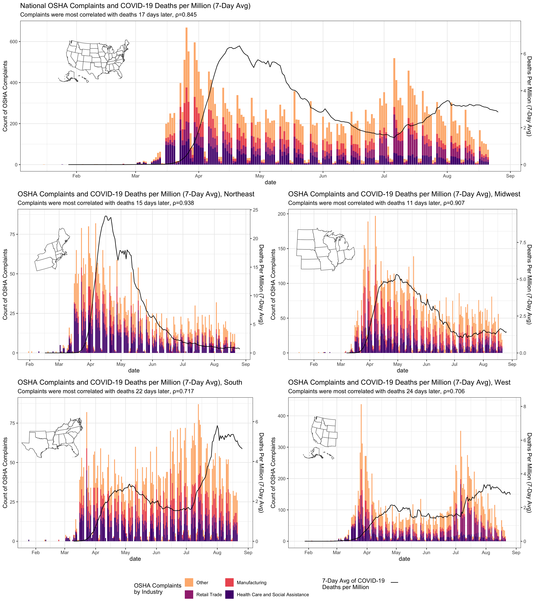

# OSHA Complaints and COVID-19

This repository stores the code which was used to render figures and analyses for our 
*COVID-19: US Federal accountability for entry, spread, and inequities* manuscript. 

The figures are produced by the scripts in `inst/figures/`.  

The R package contained herein standardizes the methods to load the OSHA complaints, 
and clean the data.

## References 

2017 National American Industrial Classification System <https://www.census.gov/eos/www/naics/2017NAICS/2017_NAICS_Manual.pdf>
[[webarchive](http://web.archive.org/web/20200719224821/https://www.census.gov/eos/www/naics/2017NAICS/2017_NAICS_Manual.pdf)]
Retrieved July 1 2020.

COVID-19 related OSHA complaints released through FOIA. <https://www.osha.gov/foia#covid-19> Retrieved August 23 2020.

The COVID Tracking Project, Data for All States. <https://covidtracking.com/data/download>. Retrieved August 27 2020.
