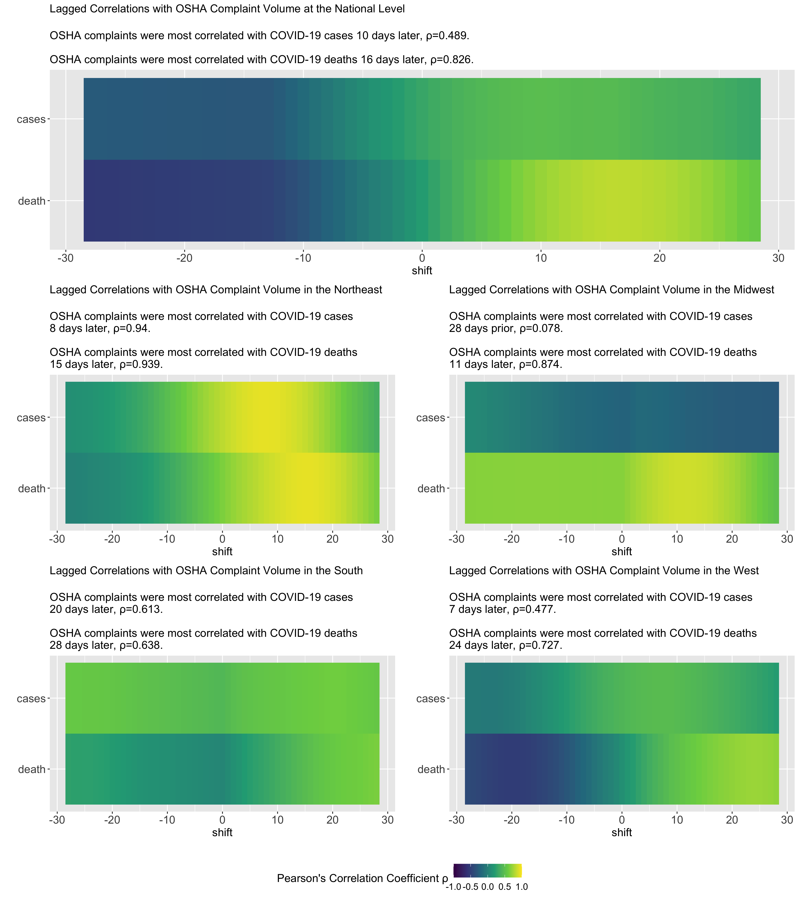

# OSHA Complaints and COVID-19

This repository stores the code which was used to render figures and analyses
for the *COVID-19: US Federal accountability for entry, spread, and
inequities—lessons for the future* manuscript. 

**Authors:** W. P. Hanage^1, C. Testa^2, J. T. Chen^2, L. Davis^3, E. Pechter^3, P. Seminario^4 M. Santillana^5 and N. Krieger^2

1. Center for Communicable Disease Dynamics, Department of Epidemiology, Harvard T. H. Chan School of Public Health, Boston, MA.

2. Department of Social and Behavioral Sciences, Harvard T.H. Chan School of Public Health, Boston, MA.

3. Occupational Health Surveillance Program, Massachusetts Department of Public Health, Boston, MA.

4. AFL-CIO (retired), Washington DC.

5. Computational Health Informatics Program, Boston Children’s Hospital, Boston, MA

---

The figures are produced by the scripts in `inst/figures/`.  

The R package contained herein standardizes the methods to load the OSHA complaints
and clean the data.

### Figure 1. National OSHA complaints and COVID—19 deaths per million (7 Day Average), January 16-September 18, 2020 

### Figure 2. Heatmaps showing the lagged correlations between OSHA complaint volume and COVID-19 cases and COVID-19 deaths, nationally and by US region, January 16, 2020 – September 30, 2020.

## References (only for figures)

2017 National American Industrial Classification System <https://www.census.gov/eos/www/naics/2017NAICS/2017_NAICS_Manual.pdf>
[[webarchive](http://web.archive.org/web/20200719224821/https://www.census.gov/eos/www/naics/2017NAICS/2017_NAICS_Manual.pdf)]
Retrieved July 1 2020.

COVID-19 related OSHA complaints released through FOIA. <https://www.osha.gov/foia#covid-19> Retrieved October 1st 2020.

The COVID Tracking Project, Data for All States. <https://covidtracking.com/data/download>. Retrieved October 1st 2020.
